# REPOSITORIO DE 5 APLICATIVOS MAS EL AGREGADO MEDIANTE OZM V1 NO INCLUYENDO ARMONICOS

Este es el repositorio que constituye el segundo experimento con ozm v1 usando datos acoplados temporalmente. El acople temporal nos indica que hay sincronización en el tiempo entre las diferentes medidas de los diferentes medidores asociados a la sincronización de uso común y el medidor común principal. En este experimento solo se se incluyen las medidas habituales ( no usaremos los armónicos de tensión, corriente y potencia).

El OZM v1 es un medidor monofásico de energía eléctrica (aunque ya existe una versión trifásica), que es además también analizador de calidad de la energía. Este dispositivo, es tanto de código abierto como de hardware abierto, y ha sido desarrollado conjuntamente entre las Universidades de Almería y Granada, contando además con capacidades de IoT, lo cual no sólo nos permite medir una amplia gama de variables eléctricas a una elevada frecuencia de muestreo de 15625 Hz (voltaje, intensidad, potencia activa, potencia reactiva, distorsión armónica total o THD, factor de potencia y armónicos tanto de intensidad como de voltaje y potencia hasta el orden 50), sino que también nos permite capturar y tratar todas esas medidas.

Usamos 6 contadores tipo OZM aplicados a 5 electrodomésticos de uso común. Este es listado de dispositivos:

1- Mains (contador principal)

2-Hervidor de agua

3-Ventilador

4-Congelador

5- TV

6-Aspiradora

En este repositorio se analiza el impacto de NO tomar los armónicos para desagregar el consumo eléctrico usando OZM v1 y el Toolkit NILMTK. En éste especificamos el número de medidas soportadas por los diferentes OZM, como son la potencia activa, aparente y reactiva, la frecuencia, el voltaje, la corriente y el factor de potencia. NO añadimos los armónicos de la tensión (50), corriente (50) y potencia (50), es decir,se ignoran los armónicos.

Se adjunta en un directorio aparte dentro de root, el contenido de los ficheros yaml de metadatos, así como el nuevo convertidor que desprecia también los armónicos. Destacar que en los cuadernos de Jupyter Notebook no solo está el código en Python sino también los resultados de ejecutar sobre el dataset DSUALM0H, Asimismo, mencionar que para ejecutar este código necesitamos tener instalado el toolkit NILMTK (disponible también en Github), así como también disponer del nuevo dataset que ya incluye los armónicos.

**DEBIDO A SU TAMAÑO, POR SU EXTENSION NO ESTAN DISPONIBLES LOS FICHEROS DE DATOS EN FORMATO CSV EN ESTE REPOSITORIO EN CONCRETO, PERO SI ESTA DISPONIBLE EN EL RESPOSITORIO DSUALMH EL DATASET COMPLETO CON TODOS LOS ARMONICOS.**

Nota: El DS al exceder de 25MB se ha subido comprimido con el programa winrar.

Nuestro objetivo es proporcionar a los investigadores de NILM nuevos repositorios de datos para ampliar el abanico existente. Dado que estos nuevos conjuntos de datos pueden contener más de 150 variables eléctricas registradas a alta frecuencia en diferentes aplicaciones de uso cotidiano, al ofrecer esta amplia gama de datos, esperamos impulsar y mejorar las investigaciones en el campo del NILM.

A continuación, pues si más dilación, se expone de forma genérica las conclusiones principales de tomar solo los armónicos impares, despreciando todos los armónicos o tomando todos ellos (pares e impares).

# INTRODUCCION

Dada la actual crisis energética, ha vuelto a tomar protagonismo el enfoque denominado Monitorización no Intrusiva de la Carga o NILM, el cual consiste en estimar los consumos individuales de los diferentes aparatos eléctricos conectados a un punto central partiendo de un único medidor inteligente. En este contexto contamos con el NILMTK l cual proporciona un completo pipeline compuesto por convertidores, métricas de evaluación, algoritmos, etc. que reduce la barrera de entrada para investigadores.

Por otro lado, el OZM es un medidor avanzado de energía eléctrica, que es además también analizador de calidad de la energía. Es de código y hardware abierto, contando además con capacidades de IoT, pudiendo medir una amplia gama de variables eléctricas a una elevada frecuencia de muestreo de 15625 Hz [17] incluyendo transitorios de voltaje, corriente y potencia hasta el orden 50.

Ilustración 1-Aspecto del OZM

Precisamente gracias a las características del OZM, el objetivo de este trabajo es usando los datos arrojados por los nuevos dispositivos, mostrar el uso y potenciales aplicaciones en cuanto a la desegregación de la energía con estos datos, adaptando para ello la herramienta de monitoreo de carga no intrusivo NILMTK. Hay que destacar que para capturar los datos de los OZM tanto sin usar armónicos como usando los armónicos de tensión, corriente y potencia hasta el orden 50, así como asociar los correspondientes metadatos del OZM, se proporcionan dos nuevos conversores y convertidores que nos han permitido crear dos nuevos DS: DSUALM y DSUALMH almacenándose en el formato HDF5.

# TRABAJOS RELACIONADOS

En cuanto a los métodos existentes de desagregación de energía se pueden clasificar en cuatro grupos principales: **métodos de optimización** (destacando Vector Support Machines o SVM , Bird swarm algorithm o BSA , algoritmos genéticos y Particle Swarm Optimization o PSO entre otros), **métodos supervisados** (destacando los clasificadores bayesianos , Support Vector Machine o SVM , el algoritmo Discriminative Disaggregation Sparse Coding o DDSC , las Redes Neuronales Artificiales o ANN, así como sus extensiones), **métodos no supervisados** (destacando el de optimización combinatoria o CO, los modelos de Markov o HMM y sus extensiones, como el FHMM ), y **otros**.

Por otro lado existen Dataset Públicos que pueden ser usados para probar y comparar los resultados ofrecidos por diferentes algoritmos de desagregación de energía, entre los que destacamos **AMPds**: lecturas para un medidor general de 1’, así como lecturas submedidas de 19 circuitos individuales, **DRED:** datos de electricidad, información ambiental, información de ocupación e información del hogar, **ECO**: datos de consumo agregado de 1 Hz y también de datos tomados a 1 Hz de electrodomésticos seleccionados en 6 hogares durante 8 meses, **GREEND**: datos de potencia tomadas a intervalos de 1 segundo de 9 electrodomésticos y la demanda de energía total de 9 hogares durante un año, **HES:** medidas de 51 electrodomésticos a intervalos de 2’ de 251 hogares en 12 meses, **IAWE**: medidas agregadas y las submedidos de electricidad y gas de 33 electrodomésticos con una resolución de 1” en 73 días de una vivienda , **REDD:** mediciones de potencia a intervalos de 3”a 4” de 6 hogares de EE.UU., **REFIT:** mediciones de potencia del agregado y 9 aparatos individuales de 20 hogares, con una resolución de 1 muestra cada 8”**, UK-DALE:** medidas agregadas a 16 kHz y datos de energía submedidos de 6” de electrodomésticos individuales en 3 hogares UK, así como un agregado de 1” y submedidos de 6” para 2 hogares adicionales , **DEPS:** lecturas a 1 Hz sobre 6 dispositivos presentes en un aula tomadas durante un mes.

# ARQUITECTURA

Para el proceso de desagregación usaremos el Toolkit NILMTK, cuyo flujo podemos ver en la ilustración siguiente.

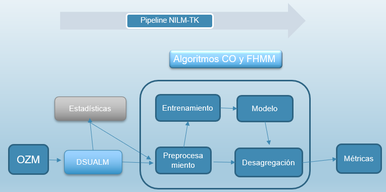

Ilustración 2-Diagrama de flujo NILMTK

1.  **Generación de los nuevos DS**

Los modelos presentados en este trabajo hacen uso de los datos de las grabaciones de varias horas de funcionamiento de diferentes dispositivos, utilizando la API de OZM, recogiendo características eléctricas fundamentales, y secundarias, como son los valores armónicos complejos de la corriente, tensión y potencia hasta el orden 50.

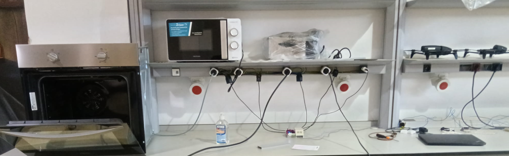

Ilustración 3-Toma de medidas con OZM

Tenemos como contenedor de las medidas recogidas de los OZM, ficheros con 160 campos de datos, campos, por cierto, los cuales, no todos serán relevantes, al menos en una primera fase de estudio, por lo que necesitamos adaptar estos para poder usarlos en el NILMTK.

En un primer paso, haremos un análisis previo de los ficheros de datos, para lo cual, inicialmente, se analizan tanto los metadatos como los datos, cuya estructura debería basarse en el formato NILMTK-DF.

A continuación, necesitamos nuevos conversores donde haremos una serie de manipulaciones con la información de los campos aportados en los ficheros de datos en formato hdfs o csv, que nos conducirán a la creación de los ficheros de datos finales de salida, los cuales salvaremos en formato csv.

La siguiente tarea, es la conversión de los diferentes ficheros de medidas en formato csv pretratados en la fase anterior a un único fichero común en formato HDF5), y que almacenamos en la carpeta “/data/” que **también contendrá todos los metadatos del DS.**

Normalmente en NILMTK se usan formatos de DS estandarizados, pero dada la exclusividad de los datos ofrecidos por el OZM, requerimos un formato de datos nuevo, para lo cual creamos dos funciones: **convert_ualm** y c**onvert_ualmt** (para procesar los transitorios).

En los directorios de los nuevos conversores situamos, no sólo el código en Python de los nuevos convertidores, sino también incluimos nuevos subdirectorios en “/metadata/”, que incluirán los ficheros de metadatos en formato yaml. Podemos ver en la Ilustración 4 la configuración de todos los ficheros necesarios para los convertidores, así como la estructura de directorios requerida.

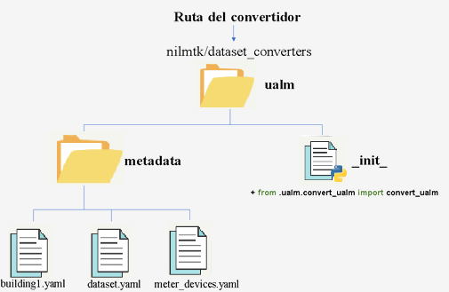

Ilustración 4-Estructura del fichero de metadatos

Como cada fichero csv es obtenido en la fase de anterior a partir de los ficheros de los OZM, es necesario numerarlos, siendo el nº 1 el correspondiente al medidor principal. Para ello, la nueva función accede a todos los citados ficheros de datos de medidas localizados en la carpeta de entrada “/electricity/”, usando para ello el fichero de etiquetas labels.csv, proceso que representamos en la Ilustración 5.

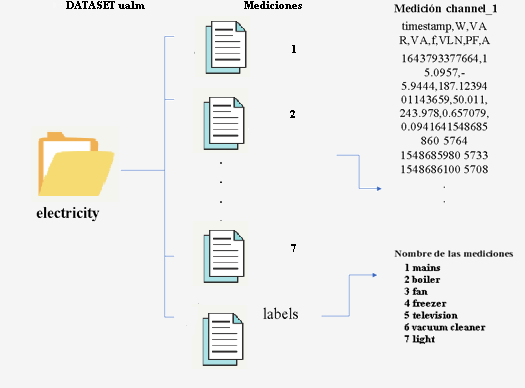

Ilustración 5-Estructura ficheros de datos

Una vez se han procesado todos los ficheros de medidas, procedemos a unir éstos en formato yaml, para posteriormente convertir la estructura de datos en un nuevo DS en formato H5. Ubicados los ficheros de datos, lo primero es invocar el conversor del DS llamando a la nueva función **convert_ualm**, pasándole la ruta de los metadatos y el nuevo nombre del fichero del DS que se generará en formato H5. Una vez creado el nuevo DS, podemos realizar un preanálisis de los datos siendo especialmente interesante representar los gráficos de tensión, potencias y corriente para los diferentes aplicativos.

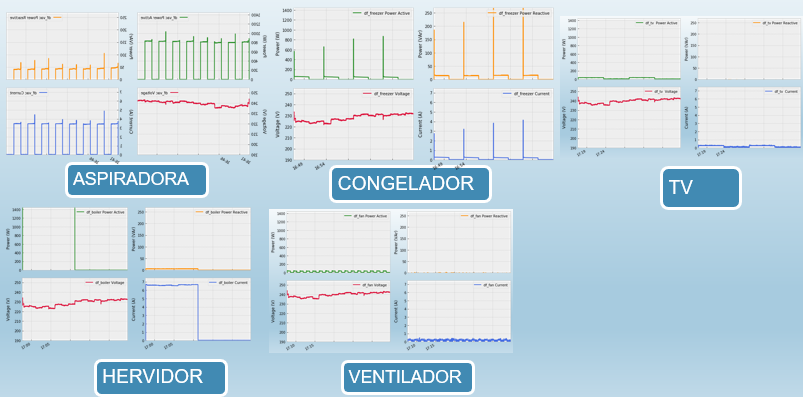

Ilustración 6- Representación de las medidas

1.  **Análisis, Preprocesamiento, Entrenamiento, Validación, Desagregación y Métricas**

Una vez hemos generado los nuevos DS podemos usar las implementaciones que dispone NILMTK para realizar un diagnóstico rápido del DS. Es especialmente interesante obtener el perfil del voltaje y obtener el grafico de área de los aplicativos (Ilustración 7).

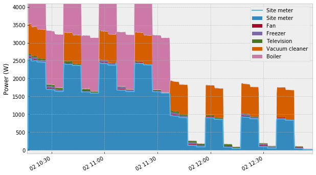

Ilustración 7-Perfil del voltaje

Es asimismo interesante conocer posibles secciones faltantes o descartar aquellas muestras con valores muy bajos (aplicando filtros).

Finalmente analizados los datos, dividiremos el DS en **set de entrenamiento, set de validación y set de pruebas.** Para entrenar el modelo, usamos dos de los modelos de desagregación que existen disponibles en NILMTK, como son los algoritmos supervisados CO y FHMM, usando la señal de potencia activa de los dispositivos. Para ello, previamente además de cargar las librerías necesarias, definiremos el DS, y asociaremos las etiquetas asociadas a los electrodomésticos y ya podemos definir el subconjunto de entrenamiento.

Definido el modelo de entrenamiento, gracias a que NILMTK implementa los dos algoritmos de desegregación, ejecutaremos los dos algoritmos CO y FHMM en dichos intervalos de tiempo (10”, 30”, 60”, 5’, 10”, 15”), para los tres métodos (First, Mean y Median) salvando los modelos generados en formato H5. Sólo tocaría implementar el modelo mejor evaluado en la etapa de validación, y de este modo podemos comparar la señal real (GT), frente a la predicha por el mejor modelo.

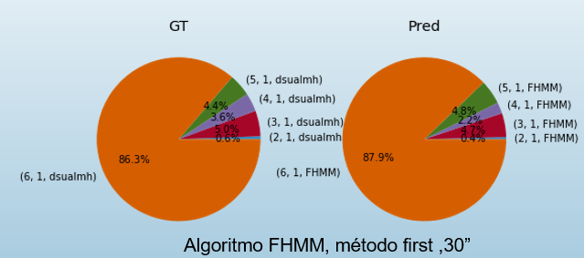

Ilustración 8-Comparación GT con medidas reales

Como vemos los resultados son bastante buenos en cuanto a las predicciones, ya que, por ejemplo, para el hervidor (en azul) sólo se presenta una pequeña desviación del 0,2% frente a los datos reales. Asimismo, tanto el ventilador (en rojo) como la luz (rosa) presentan una mínima variación y la aspiradora (en naranja) solo presenta una desviación del 1,6%.

# RESULTADOS

NILMTK cuenta con el cálculo de métricas de evaluación por medio del uso del MeterGroup, para la validación de los resultados mediante el set de validación. Es preciso ejecutar para ello, sobre los modelos obtenidos, diferentes métricas como son FEAC, F1, EAE, MNEAP y RMSE, que nos da una salida algo similar a la Tabla 1.

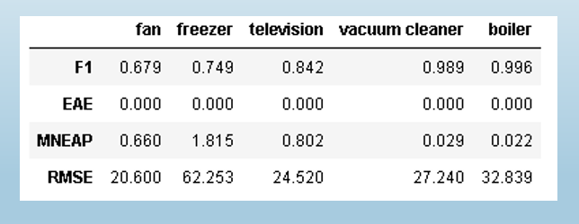

Tabla 1-Principales métricas obtenidas para los aplicativos

**Métricas F1 y MNEAP**

En cuanto a F1 la incorporación de transitorios permite una mejora para el hervidor de agua y la aspiradora, manteniéndose para el ventilador y congelador empeorando para para la TV.

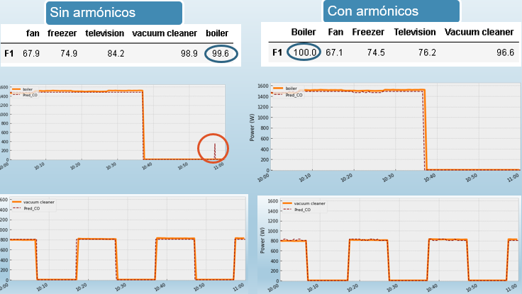

Ilustración 9-Comparación con o sin transitorios para F1

Respecto a MNEAP la incorporación de los armónicos mejora el comportamiento para el ventilador y de forma destacable para el congelador, manteniéndose para el resto de electrodomésticos en valores similares.

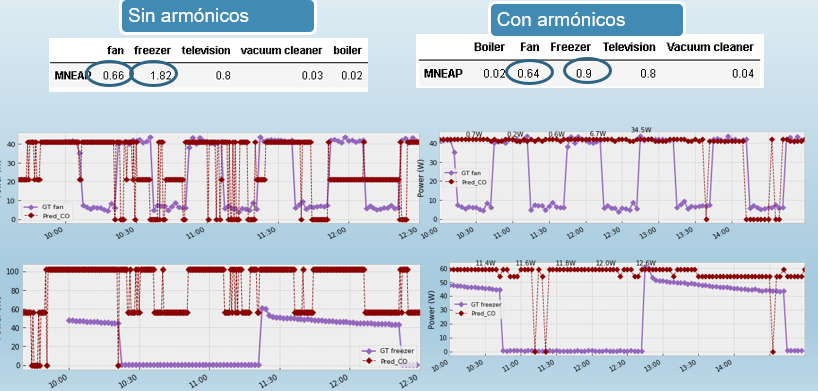

Ilustración 10-Comparación con o sin transitorios para MNEAP

**Métrica RMSE**

En cuanto a RMSE, destaca claramente la mejora del congelador (**pasa de 62,25 a 35,9**) seguido de una mejora tímida en el TV (de 24,5 a 23,2). Respecto a otros electrodomésticos, el ventilador se mantiene, y tanto el hervidor como la aspiradora, empeoran.

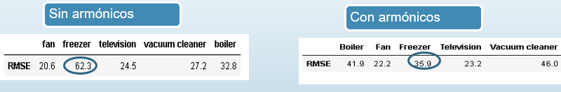

Tabla 2-Comparación con los transitorios para RMSE

**Resumen de resultados con o sin armónicos**

En general la incorporación de transitorios mejora todas las métricas para casi todos los aplicativos. Destaca especialmente el ventilador y congelador. Respecto al TV solo empeoraría par F1 y para la aspiradora o el hervidor solo lo haría para RSMSE.

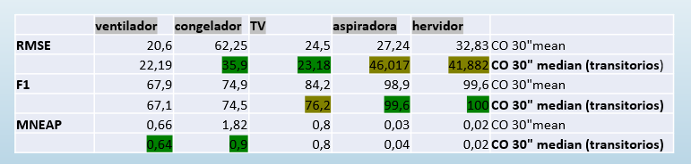

Ilustración 11 Resumen métricas con o sin transitorios

**Comparación con otros DS**

Para el DS de IAWE los resultados nos evidencian que el algoritmo más eficiente para este DS es el combinatorio (CO) usando el método Mean y **periodo 10 minutos frente sólo a los 10 segundos necesarios con los datos del OZM**.

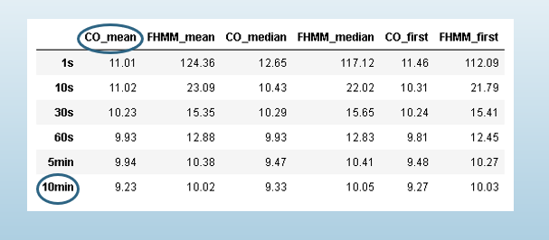

Ilustración 13 Resultados IAWE

Por otro lado, los resultados obtenidos para el DS de DEPS nos evidencian un mejor rendimiento para el algoritmo CO, método Mean, pero **a un tiempo de muestreo de media hora frente sólo a los 10 segundos necesarios con los datos del OZM**.

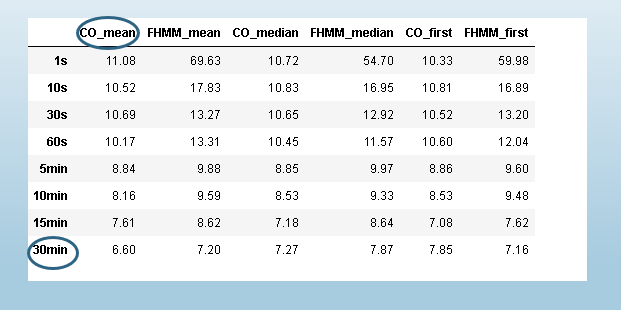

Ilustración 14-Resultados DEPS

Asimismo, si comparamos GT y Pred para el DS de DEPS las divergencias son muy importantes oscilando entre 1,4%, 4,6% y 4,9% frente al 0 y 1,6% que tenemos en DSUAL.

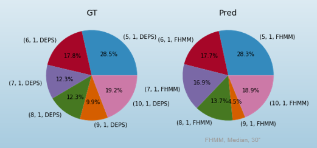

Ilustración 15-Comparación GT con Pred para DEPS

# CONCLUSIONES

En este trabajo en el ámbito de NILMTK además de incorporar tanto las métricas como las herramientas disponibles en el toolkit, se ha incorporado como novedad el nuevo formato de timestamp de 13 dígitos además de dos nuevos conversores para las medidas obtenidas de OZM (con o sin transitorios ) así como dos nuevos convertidores basados en IAWE (con o sin transitorios ) de modo que de este modo se elimina la barrera de entrada a todo aquel investigador que cuente con uno o varios OZM y desee acceder al NILM .

Por otro lado, si comparamos los resultados de las métricas obtenidas sobre DSUALM o DSUALMT, frente a IAWE o DEPS los resultados son mucho peores especialmente en cuanto al periodo de muestreo necesario, destacando especialmente los valores obtenidos para la métrica MNEAP.

# Publicaciones

Hay un artículo de mi autoría sobre el NILM que usa el hardware OZM monofásico en lugar del OZM v2:

\- C. Rodriguez-Navarro, A. Alcayde, V. Isanbaev, L. Castro-Santos, A. Filgueira-Vizoso, and F. G. Montoya, “DSUALMH- A new high-resolution dataset for NILM,” \*Renewable Energy and Power Quality Journal\*, vol. 21, no. 1, pp. 238–243, Jul. 2023, doi: 10.24084/repqj21.286.

Asimismo, con el fin de hacer replicable todo este trabajo se ha desarrollado un nuevo multi contador abierto llamado OMPM esta publicada en la revista científica “Inventions:”

\- C. Rodríguez-Navarro, F. Portillo, F. Martínez, F. Manzano-Agugliaro, and A. Alcayde, “Development and Application of an Open Power Meter Suitable for NILM,” \*Inventions\*, vol. 9, no. 1, p. 2, Dec. 2023, doi: 10.3390/inventions9010002.
